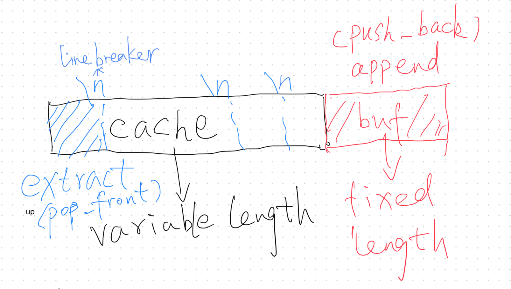
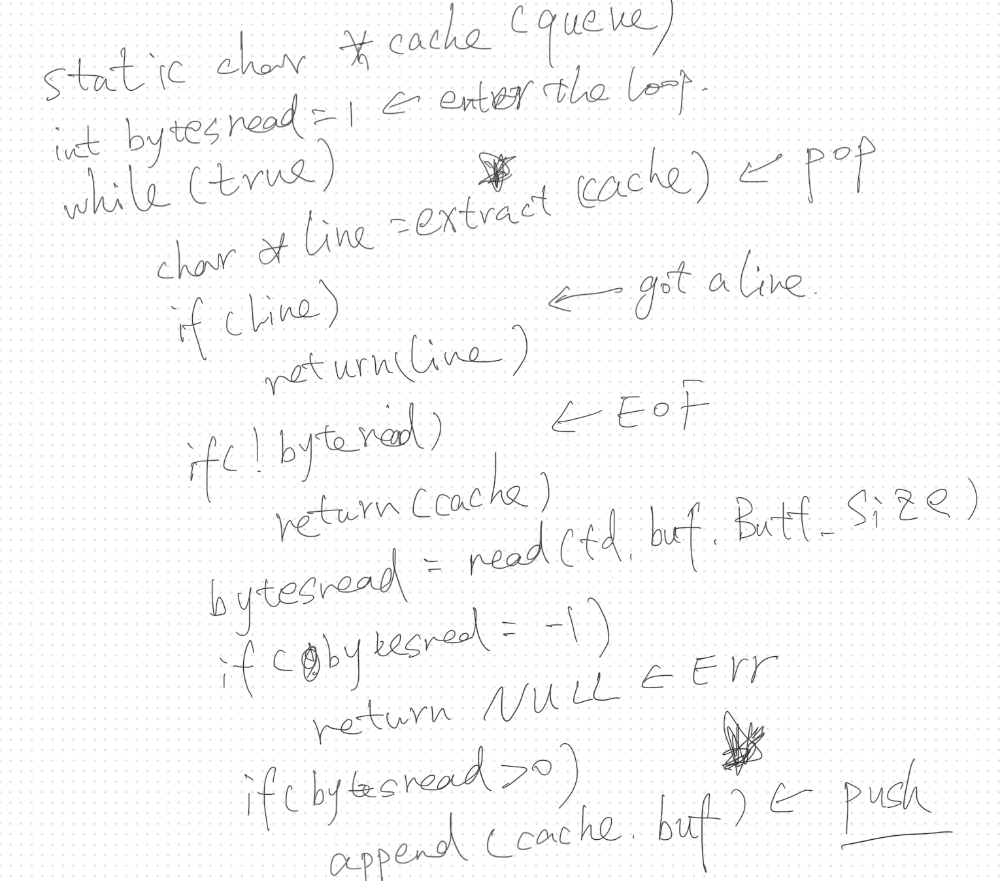

## Thoughts on `get_next_line`

This was an intersting project I encountered at Hive. It helped me better understand how to maintain **state** in procedural programming with C and it's my first time to make **data structure selection** in a Hive project.

### Challenge
In short, the goal was to implement a function that reads a file and returns its content line by line.  
The main challenge was the requirement to support a **custom buffer size** while **disallowing `lseek`**, meaning we had to maintain a persistent string inside the function.

### Analysis

The main logic involves three key components:

1. **Queue**:  
   We need to maintain a variable-length queue (referred to as `cache` here) that supports:
   - **Push**: Appending new data read from the file to the end of the queue.
   - **Pop**: Extracting a single line from the beginning of the queue.

2. **Push Logic**:  
   This uses a fixed-size buffer (defined during compilation) to read chunks from the file and append them to the end of the queue.

3. **Pop Logic**:  
   The function searches the queue for a `\n` or `EOF`, extracts the line, and retains the unprocessed part of the queue for subsequent calls.

### Data Structure Selection
For the queue, we typically choose between **arrays** and **lists**. Here's a comparison:

| Data Structure      | Pros                                       | Cons                                                                                     |
|---------------------|-------------------------------------------|------------------------------------------------------------------------------------------|
| **Array (char)**    | Simple implementation                     | Time or space efficiency can only be optimized for one, not both                         |
| **List (char)**     | Optimal time and space complexity          | More complex to implement, especially under strict line-of-code limitations at Hive      |
| **List (string)**   | Good time and space complexity for splitting lines | CPU caching inefficiencies might impact real-world performance                            |

### Implementation

Given the constraints of the project, I opted for a **char array** for simplicity, balancing implementation complexity and performance. My implementation follows this logic:

1. If the `queue` (referred to as `cache`) can successfully `pop` (via the `extract_line` function) a complete line, it immediately returns the line.
2. Otherwise, it continuously `pushes` data (using `read_from_file` and `append_str`) into the queue until a complete line is found.

This approach is space-efficient, as the `queue` only holds the unprocessed portion of the file at any time. However, each `push` and `pop` operation incurs a cost of memory copying, which impacts performance.  

#### Key Points

1. **Handling `pop` Scenarios**:  
   The `pop` operation (`extract_line`) considers two scenarios:
   - It returns a line when encountering a line-break (`\n`).
   - It returns the whole `queue` when reaching EOF (via `replicate_str`).

2. **Memory Management**:  
   Properly freeing memory is critical.  
   I ensure that the queue (or `cache`) is freed once its length reaches `0`, a lesson learned after spending 3 hours debugging a memory leak caused by an empty `cache`.

### About State Variable

In a discussion with Lauri, we found that state variables are not stored in the stack or heap. Instead, they live in the same memory region as global variables, the static storage area.

While global variables can be accessed by all functions in the program, state variables can only be assessed by the function who define it.
