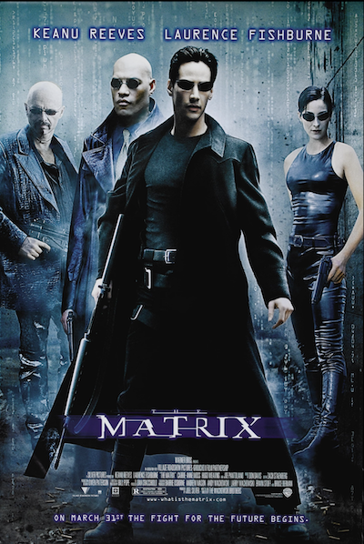

## Thoughts on `pipe_x`

This has been one of the most interesting projects I've worked on so far. The **mandatory part** of the project involves implementing a pipeline like this:  
`< infile cat | grep -a > outfile`  

The **bonus part** requires extending the implementation to handle more complex cases, such as:  
`<< here_doc | grep -a | ... | cat | wc -l > outfile`

Since the next project is **mini_shell**, I aimed to design a reusable and extensible data structure for two projects. Instead of starting with the mandatory part, I focused on designing the bonus features from the beginning. I also went beyond the requirements by implementing additional functionalities, even for the bonus section, to make the solution more general-purpose.

---

### Challenges

1. **Linux Fundamentals**  
   This project challenges foundational Linux concepts, particularly process creation and management (`fork`, `exec`), inter-process communication (`pipe`), and file redirection. While my experience with courses like [CS:APP](https://csapp.cs.cmu.edu/) and [6.1810](https://pdos.csail.mit.edu/6.S081/2024/) provided a foundation to get started, implementing this project pushed me to go deeper into the operating system behavior. Many of the implementation details brought clarity to concepts I previously found abstract, making them **crystal clear**.

2. **Implementation Strategy**  
   Writing a shell-like program involves a lot of error handling. My approach was to simplify the code by designing a flexible and well-structured **Abstract Syntax Tree (AST)** to represent the pipeline. This tree-based structure, combined with a polymorphic design in C, made the implementation more modular and easier to extend.

### Linux Fundamentals

#### Operating System Fundamentals in This Project

I’ll try to explain these concepts in a way that is easy to understand, though not strictly professional. If you want to explore operating systems more deeply, I highly recommend the two courses I mentioned earlier—probably the best on this planet.

1. **Process**

- A process is an abstraction that represents the execution of a program on a computer system. A process operates independently and is unaware of the existence of other processes. It is responsible for running a program and reporting its status upon completion.

- A process behaves as if it has full control over the computer's hardware (although this is not the case in reality, have you watched the movie [The Matrix](https://www.imdb.com/title/tt0133093/)), including the CPU, memory, storage, etc. Most basic C programs are executed within a single process.

- The lifecycle of a process is similar to that of a function—it has a birth, a runtime, and an eventual termination. While a process does not take arguments like a function, it does return a status code upon completion.

- After Linux starts, it runs within a single process. From there, another process, called the **shell**, is launched to allow user interaction and control.

2. **fork()**

- **fork()** is a sys-call used to create a new process. The process creation is essentially cloning. In Linux, **fork()** duplicates everything in the original process, including memory (both stack and heap), the program counter (PC), and other states. It’s like the cloning process in the movie [The Island](https://www.imdb.com/title/tt0399201/).
- There are two key points about **fork()**:

   1. **Everything is copied**: 
   After the fork(), the child process gets its own copy of everything from the parent, such as memory and file descriptors. However, any changes made by the child process do not affect the parent process and vice versa. Due to this independent memory copy, if the heap memory is allocated, it must be cleaned up before the child process exits to prevent leaks.

   2. **Who am I?**: 
   Imagine this sci-fi scenario: after the cloning, both the original and the clone wake up with the same memories. The first question they need to answer is, "Who am I? Am I the original or the clone?"
   Linux has a clever solution to this: when **fork()** completes, it returns a pid (process ID). Since the return value of fork() is what distinguishes the processes:
     - The parent process receives the PID of the child process.
     - The child process receives 0.
   This allows the processes to determine their identities right after the fork().

3. **exec()**

- To be honest, **exec()** is an evil. It likes the movie [The Strain](https://www.imdb.com/title/tt2654620/). After been called, the entire memory space of the process is replaced with the memory space of the new program. Essentially, the original process “loses its soul,” and its body is taken over by the new program.

- When **exec()** is called, the calling program loses control permanently.

- The combination of **fork()** and **exec()** is the way how linux creates new processes. 
   - **fork()** creates a duplicate of the current process, known as the child process.
   - **exec()** replaces the memory and code of the child process with a new program, effectively launching it.

4 **pipe**

A **pipe** is a tool for inter-process communication (IPC). It works by creating a temporary data channel that allows one process to send data to another. Pipes are implemented using kernel memory, not user-space memory like the stack or heap, so multiple processes can safely access this shared memory.

**Key Points**:
- A **pipe** consists of **two file descriptors**:
  - One for **reading**.
  - One for **writing**.
- At any given time, **only one process should hold the read end**, and **only one process should hold the write end**. Having multiple processes holding the same end (read or write) can lead to undefined behavior.
- A pipe behaves like a **stream**: the writer can continue to write data until it explicitly sends an EOF (or closes the write end).
- If the **reader** closes its end, any subsequent `write()` call by the writer will result in the operating system sending a `SIGPIPE` signal to the writer process. If the signal is not handled, the writer process will terminate.
- Pipes have a **capacity limit**. If the writer tries to send more data than the pipe can hold, the process will block until space becomes available, or an error occurs.