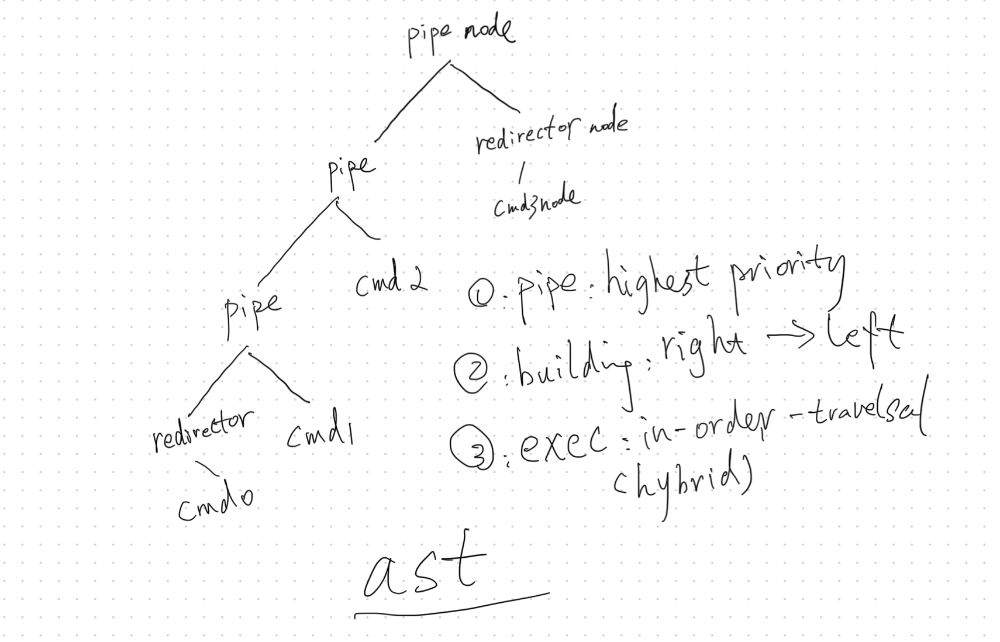
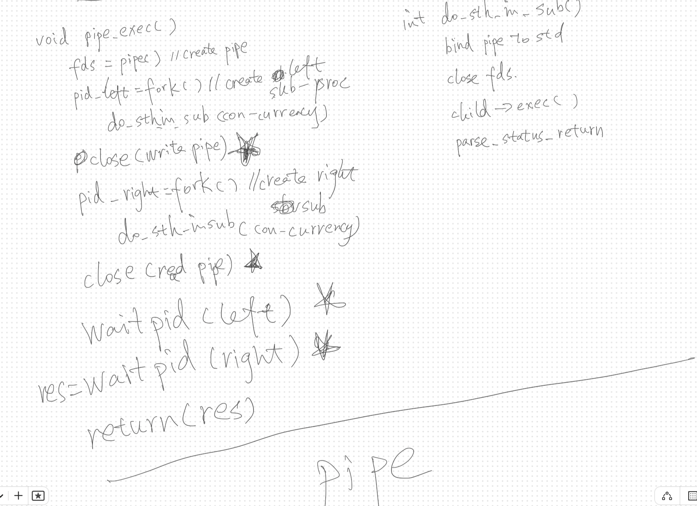
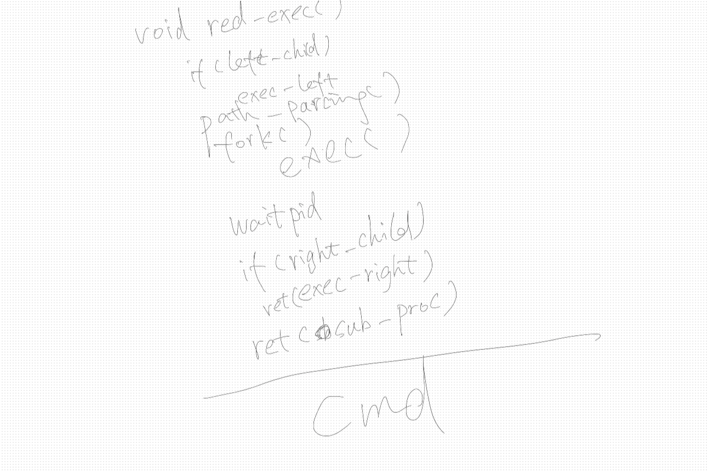

## Thoughts on `pipe_x`

This has been one of the most interesting projects I've worked on so far. The **mandatory part** of the project involves implementing a pipeline like this:  
`< infile cat | grep -a > outfile`  

The **bonus part** requires extending the implementation to handle more complex cases, such as:  
`<< here_doc | grep -a | ... | cat | wc -l > outfile`

Note: The pipeline will attempt to complete execution even if some nodes encounter errors.

Since the next project is **mini_shell**, I aimed to design a reusable and extensible data structure for two projects. Instead of starting with the mandatory part, I focused on designing the bonus features from the beginning. I also went beyond the requirements by implementing additional functionalities, even for the bonus section, to make the solution more general-purpose.

---

### Challenges

1. **Linux Fundamentals**  
   This project challenges foundational Linux concepts, particularly process creation and management (`fork`, `exec`), inter-process communication (`pipe`), and file redirection. While my experience with courses like [CS:APP](https://csapp.cs.cmu.edu/) and [6.1810](https://pdos.csail.mit.edu/6.S081/2024/) provided a foundation to get started, implementing this project pushed me to go deeper into the operating system behavior. Many of the implementation details brought clarity to concepts I previously found abstract, making them **crystal clear**.

2. **Implementation Strategy**  
   Writing a shell-like program involves a lot of error handling. My approach was to simplify the code by designing a flexible and well-structured **Abstract Syntax Tree (AST)** to represent the pipeline. This tree-based structure, combined with a polymorphic design in C, made the implementation more modular and easier to extend in future project.

---

### Data Structure

In this project, I implemented an **Abstract Syntax Tree (AST)** based on a [Binary Tree](https://www.geeksforgeeks.org/binary-tree-data-structure/).

- The **Binary Tree** structure was chosen to simplify both the `building` and `execution` processes. Based on my learning in [CS61A](https://cs61a.org/), this type of **recursive data structure** is well-suited for solving interpreter-like problems.
- **AST** is a widely-used data structure for syntax parsing in many systems, such as [PostgreSQL](https://www.postgresql.org/) and [Node.js](https://nodejs.org), as well as in `bash`. By implementing an AST, I aimed to mimic the behavior of `bash` while managing the complexities of different execution sequences in a more structured way.
- Actually, **AST** is totally unnecessary for this project, I applied this for preparing the `mini-shell` project.

---

### Polymorphism

I experimented with implementing [Polymorphism](https://stackify.com/oop-concept-polymorphism/) in `C` as part of my effort to explore and incorporate more `OOP` concepts into `C` during my journey through the `42cursus` projects.

- `void`
The `prop` property is `void` type, which enables the node to hold different kinds of data, depending on its type. This idea is inspired by ([Generics](https://www.geeksforgeeks.org/generics-in-java/)) in JAVA. This setup allows the AST node to have flexible and type-specific properties, while still sharing a unified interface `AST node`.

- function pointers for Polymorphic methods
The `node_handler` and `node_closer` are function pointers which like `interfaces` in **Java** or `pure virtual methods` in **C++**. These pointers allow each AST node to execute behaviors specific to its type. For instance, a `pipe` node and a `command` node can each have their own implementation of `node_handler`, even though the function pointer in the struct is the same. This provides the `polymorphic` behavior where the actions depend on the node type.

- Advantages
   - This `Polymorphism`-like design simplifies the complexity of handling different node types in the `AST`. Each node adheres to the same interface but exhibits different behavior during execution, aligning with the `Open/Closed` Principle from OOP.
   - Decoupling and Extensibility. This design approach brings clear benefits in terms of decoupling and extensibility, we can easily **add** or **modify** a node without affecting other implementation.
   - By following this design, the AST structure is both scalable and maintainable, making it easier to accommodate new requirements or change existing ones without impacting unrelated functionality.

```c
typedef struct s_ast_node
{
	t_node_type type;
	void					*prop;
	int					(*node_handler)(t_ast *t_ast, t_ast_node *t_ast_node);
	void					(*node_closer)(t_ast_node *t_ast_node);
	t_ast_node			*left;
	t_ast_node			*right;
}							t_ast_node;

typedef struct s_pipe_prop
{
	int					fds[2];
	pid_t					pids[2];
}							t_pipe_prop;

typedef struct s_cmd_prop
{
   ...
}
```

---

### Implementation

The two major parts for this project is to build an AST, and then execute it.

#### AST Building

- We build the tree from right to left. Since we have to prepare sub-processes, so the right-most `pipe` should be the `root`.
- `Pipe` is the highest priority node.
- We try to find the first `pipe` from right to left, set it as `root`.
- Then deal with it's `left` and `right` recursively.
- The `redirctor` should not be a `leaf`(a node without a child), it has at least one `cmd` node. 
- In this project, I simplified the process as a loop.

This is typical tree for:
```c
./pipex infile cmd0 cmd1 cmd2 cmd3 outfile
```


#### AST Executing
- Executing a tree is a recursive process.
- Typically, it follows the [In Order Traversal](https://www.geeksforgeeks.org/tree-traversals-inorder-preorder-and-postorder/#inorder-traversal).
- But for `pipe` node, it's actually a `hybrid order traversal`, since we deal with the `node` first, then `left`, then `right`, then `node`.
- Therefore, actually we execute the node from left to right.

##### Pipe Executing #####
You can also check the below `Linux Fundamentals` first.

- The most important thing for `pipe`, is to deal with the 2 `sub-processes`, and 2 `fd` from `pipe` in right **sequence.**.
- We have to apply sub-process for the both sides of `pipe`.
   - The both sides of commands run con-currencyly. In this project, it's also possible to avoid this complicity, but it depends on the evaluator.
   - `redirector` should be treated `Locally`, not `Globally`.
- Note we only need the return value from left side.
- The psudeo code as follows


##### Command Executing #####
You can also check the below `Linux Fundamentals` first.

- The most important thing for `command`, is to deal with the `env` and the `exec`.
- We have to apply sub-process for `command` because after `exec`, we lost the control to the process, but we still have to deal with the return value, and continue our traversal.

---

### Linux Fundamentals

#### Operating System Fundamentals in This Project

I’ll try to explain these concepts in a way that is easy to understand, though **NOT strictly professional**. If you want to explore operating systems more deeply, I highly recommend the two courses I mentioned earlier—probably the best on this planet.

1. **Process**

- A process is an abstraction that represents the execution of a program on a computer system. A process operates independently and is unaware of the existence of other processes. It is responsible for running a program and reporting its status upon completion.

- A process behaves as if it has full control over the computer's hardware (although this is not the case in reality, have you watched the movie [The Matrix](https://www.imdb.com/title/tt0133093/)), including the CPU, memory, storage, etc. Most basic C programs are executed within a single process.

- The lifecycle of a process is similar to that of a function—it has a birth, a runtime, and an eventual termination. While a process does not take arguments like a function, it does return a status code upon completion.

- After Linux starts, it runs within a single process. From there, another process, called the **shell**, is launched to allow user interaction and control.


2. **fork()**

- **fork()** is a sys-call used to create a new process. The process creation is essentially cloning. In Linux, **fork()** duplicates everything in the original process, including memory (both stack and heap), the program counter (PC), and other states. It’s like the cloning process in the movie [The Island](https://www.imdb.com/title/tt0399201/).
- There are two key points about **fork()**:

   1. **Everything is copied**: 
   After the fork(), the child process gets its own copy of everything from the parent, such as memory and file descriptors. However, any changes made by the child process do not affect the parent process and vice versa. Due to this independent memory copy, if the heap memory is allocated, it must be cleaned up before the child process exits to prevent leaks.

   2. **Who am I?**: 
   Imagine this sci-fi scenario: after the cloning, both the original and the clone wake up with the same memories. The first question they need to answer is, "Who am I? Am I the original or the clone?"
   Linux has a clever solution to this: when **fork()** completes, it returns a pid (process ID). Since the return value of fork() is what distinguishes the processes:
     - The parent process receives the PID of the child process.
     - The child process receives 0.
   This allows the processes to determine their identities right after the fork().


3. **exec()**

- To be honest, **exec()** is an evil. It likes the movie [The Strain](https://www.imdb.com/title/tt2654620/). After been called, the entire memory space of the process is replaced with the memory space of the new program. Essentially, the original process “loses its soul,” and its body is taken over by the new program.

- When **exec()** is called, the calling program loses control permanently.

- The combination of **fork()** and **exec()** is the way how linux creates new processes. 
   - **fork()** creates a duplicate of the current process, known as the child process.
   - **exec()** replaces the memory and code of the child process with a new program, effectively launching it.


4 **pipe**

A **pipe** is a tool for inter-process communication (IPC). It works by creating a temporary data channel that allows one process to send data to another. Pipes are implemented using kernel memory, not user-space memory like the stack or heap, so multiple processes can safely access this shared memory.

**Key Points**:
- A **pipe** consists of **two file descriptors**:
  - One for **reading**.
  - One for **writing**.
- At any given time, **only one process should hold the read end**, and **only one process should hold the write end**. Having multiple processes holding the same end (read or write) can lead to undefined behavior.
- A pipe behaves like a **stream**: the writer can continue to write data until it explicitly sends an EOF (or closes the write end).
- If the **reader** closes its end, any subsequent `write()` call by the writer will result in the operating system sending a `SIGPIPE` signal to the writer process. If the signal is not handled, the writer process will terminate.
- Pipes have a **capacity limit**. If the writer tries to send more data than the pipe can hold, the process will block until space becomes available, or an error occurs.