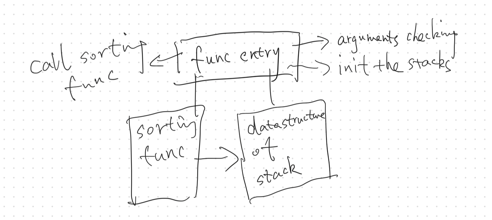
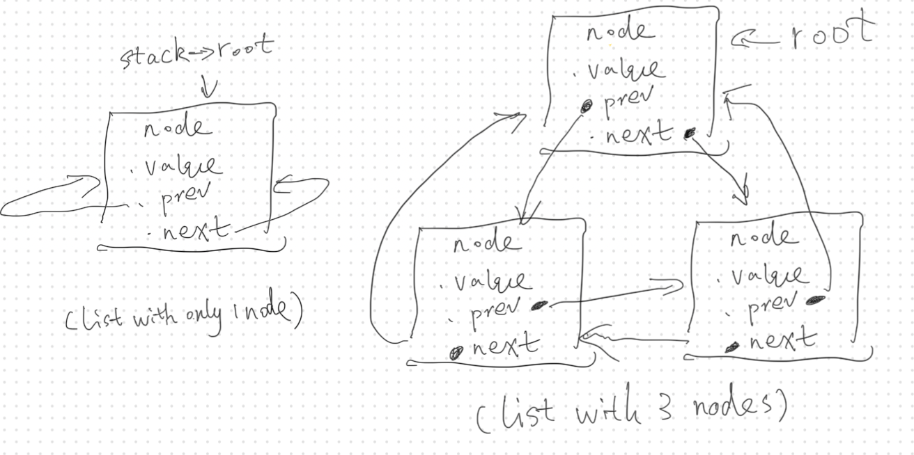
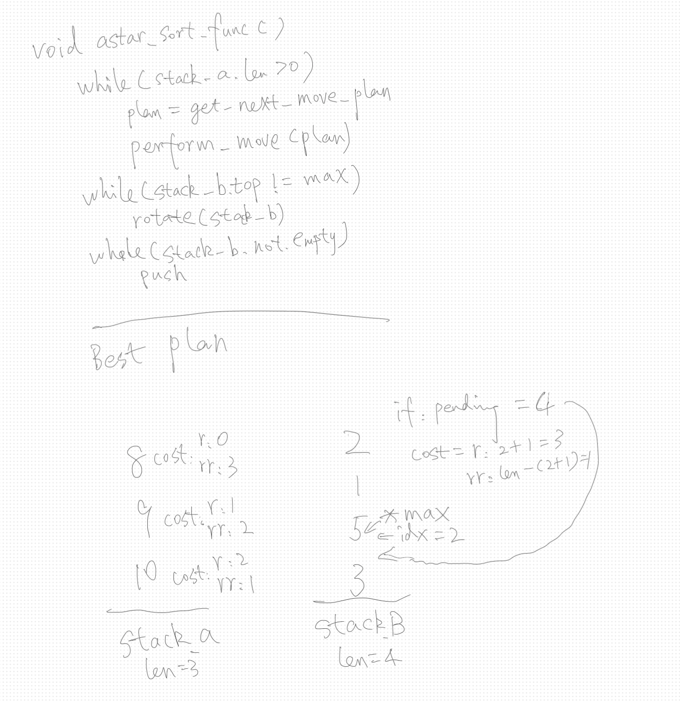

## Thoughts on `push_swap`

### Analysis:

In this project, the goal is to implement an integer sorting algorithm using two stacks. The supported operations for the stacks include:

- **Swap** the top elements of a stack (`s` operation),
- **Double-way rotation** (`r` or `rr` operation),
- **Double-rotation** (`rrr` operation),
- **Move** the top element from one stack to the other (`p` operation).

I divided the project into two main parts:
1. **Stack Implementation**: This part involves implementing the stack data structure and exposing the `s`, `r`, `rr`, and `p` operations.
2. **Sorting Algorithm**: The second part focuses on implementing the sorting algorithm.

### Project Structure:

- **Entry Function**: Serves as the entry point of the program, handling input validation, stack initialization, and calling the sorting function to perform the sorting operation.
- **Stack**: Implements the data structure and exposes the necessary stack operations (`s`, `r`, `rr`, `p`).
- **Sorting Function**: Implements the sorting algorithm.


### Data Structure:
Initially, I attempted to implement the data structure using a **circular array**. However, I realized that after performing a rotation operation, pushing elements required significant copying, making the circular array unsuitable for this purpose.

As a result, I switched to a **circular doubly linked list**. In my implementation, I decided not to use sentinel nodes, as the common practice of setting the sentinel node’s value to `INT_MAX` or `INT_MIN` was inadequate for white-box testing during evaluation.

Without a sentinel node, **the most important consideration was to avoid infinite loops**. To prevent this, I set the start and end points of the loop/recursion to `root->next` and `root`, respectively.


### Dependency Injection:
In this project, I applied the concept of **dependency injection**. This approach was chosen because it helps achieve better **decoupling** between components and makes **unit testing** more convenient.

    ```c
    int push_swap(int argc, char **argv, void (*apply_sort_func)(t_stacks *))
    {
        t_stacks *stacks;

        ...
        apply_sort_func(stacks);
        free_helper(&stacks);
        return (0);
    }
    ```
This approach allows flexibility in selecting the sorting function and facilitates easier testing by isolating dependencies.

### Object-Oriented Design:
Although C is a procedural language, I adopted an **object-oriented approach** when implementing the stack data structure to improve code organization, reusability, and maintainability.  
The stack's construction and destruction are encapsulated within factory functions, making the code more modular and reusable in different contexts.

    ```c
    typedef struct s_stack
    {
        t_node *root;
        size_t len;
        char label;
        t_node *max;
    } t_stack;

    t_stacks *new_stacks();
    t_stacks	*close_stacks(t_stacks **stacks);
    // ... other APIs
    ```
### Algorithm Section

#### Challenges

As per the project requirements, sorting **500 numbers** must be completed within **5500 operations**, implying an **O(n log n)** time complexity. Additionally, with a dual-stack design, the space complexity is restricted to **O(n)**.

#### Analysis

Traditional sorting algorithms like **merge sort** and **quick sort** can theoretically meet the time complexity requirement (quick sort achieves an average of **O(n log n)** but can degrade to **O(n²)** in the worst case). However, there are two key differences in our project that make these algorithms unsuitable:

1. **Read operations** are free, but **write operations** consume the limited number of allowed moves.
2. The stack structure does not allow **random access** to data, making traditional sorting algorithms infeasible.

After researching various approaches discussed online for this project, I decided to base my implementation on [TUK sorting](https://medium.com/@ayogun/push-swap-c1f5d2d41e97) while incorporating ideas inspired by the [A* search algorithm](https://www.geeksforgeeks.org/a-algorithm-and-its-heuristic-search-strategy-in-artificial-intelligence/) to develop a custom solution.

### A\*-like Algorithm

#### Move Cost

- **Definition**: The cost of moving an element involves:
  1. Rotating the element to the top of stack A.
  2. Pushing it to stack B.
  3. Rotating stack B to maintain its descending order.

#### Approach

1. Treat **shallow nodes** in stack A as **reachable nodes**.
2. Calculate the **move cost** for each reachable node and select the node with the **lowest cost** for the next operation.
3. Once a node is moved to stack B, continue exploring other nodes until stack A is empty.
4. Reverse stack B to complete the sorting process.

#### Optimization

- **Shallow Nodes**: By focusing only on shallow nodes, the algorithm avoids unnecessary deep rotations in stack A.
- **Dual-stack Operations**: Using dual-stack operations like **RR** and **RRR** minimizes the overall cost of rotations, further reducing the total move cost.

#### Implementation



##### Key Points

1. **`plan` Structure**
- During the operation cost calculation, a **`plan` structure** is generated simultaneously.
- This approach decouples **cost calculation** and **execution**, allowing operations to be performed without recalculating costs.

2. **Calculating Rotations for Stack B**
- When determining the number of rotations needed for **stack B** during a push operation, I maintain a pointer `*max` in **stack B** that always points to its maximum element.
- This simplifies finding the correct insertion point, minimizing computational overhead.

3. **Special Scenarios: Maximum and Minimum Values**
- Extra care is required when inserting a value that is either:
  - **Larger than the maximum** in stack B.
  - **Smaller than the minimum** in stack B.
- These edge cases must be handled explicitly to ensure the rotations are calculated correctly.

4. **Maximum Exploration Depth (Pruning)**
- To maintain efficiency, I limit the exploration depth to prevent excessive costs from moving deeply buried elements.
- Ideally, this depth would be dynamically determined based on the number of elements in the stack.
- However, to avoid the complexity of dynamic allocation, I use a **fixed hyperparameter of `60`** as the maximum depth.
  - This is the only "magic number" in the project and was chosen to balance simplicity and performance.

This hybrid approach combines the simplicity of stack operations with the heuristic-driven prioritization of **A\***, ensuring that the sorting process is both efficient and meets the constraints of the project.
