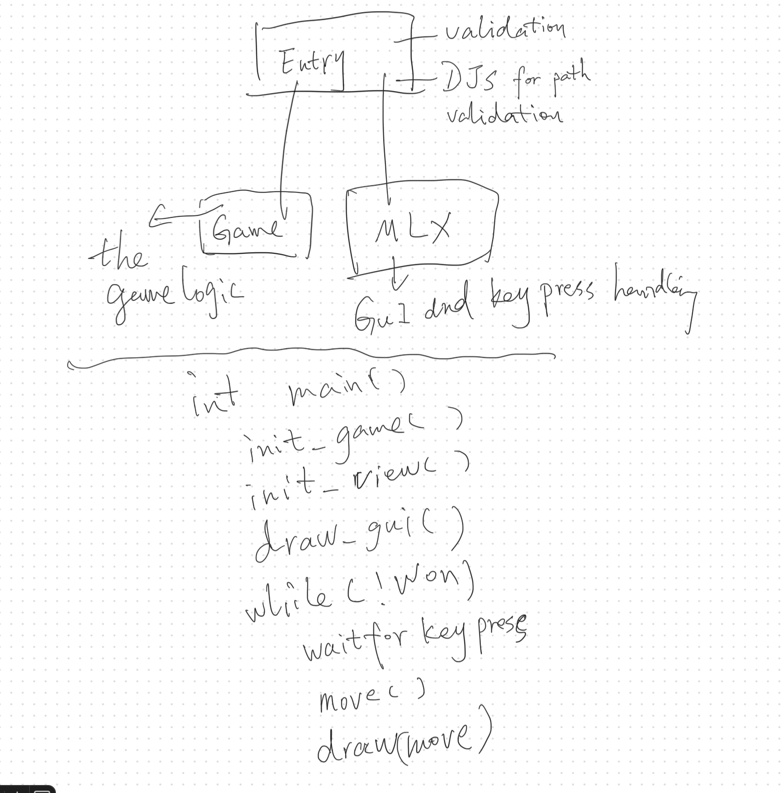

## Thoughts on `so_long`

### Analysis

The project involves implementing a 2D game similar to `Pacman` using the [MLX42](https://github.com/codam-coding-college/MLX42) library.

---

### Project Structure

- **Entry Function**: Serves as the entry point of the program, handling input validation, creating the `Game` instance, and initializing the `MLX` engine. I utilized a [Disjoint Set](https://www.geeksforgeeks.org/disjoint-set-data-structures/) for path validation.
- **Game**: Encapsulates the game logic in an `OOP`-styled "class" with a single public method called `move`.
- **Engine**: Handles the GUI rendering and keypress events by the MLX42 library.

The overall structure follows a separation of concerns, as visualized below:



---

### Data Structure

The project employs a typical `OOP`-styled data structure, which includes the following key components:

```c
typedef struct s_game
{
    int          length;
    int          height;
    t_tile       **board;
    t_player     *player;
    t_status     status;
    int          total_collectible;
}               t_game;

typedef struct s_player
{
    int          x;
    int          y;
    int          prev_x;
    int          prev_y;
    int          has_collectible;
    int          movements;
}               t_player;

typedef struct s_tile
{
    t_type       type;
    int          x;
    int          y;
    bool         is_collectible;
    bool         is_exit;
    bool         is_visited;
}               t_tile;
```

 - t_game: Manages the overall game state, including the board, player, and game status.
 - t_player: Tracks the player's current position, previous position, collected items, and movement count.
 - t_tile: Represents individual tiles on the game board, storing information such as type, position, and attributes (e.g., is_collectible or is_exit).

### Decoupling

Starting in Zone 2, I focused on decoupling the project into smaller parts and implemented unit tests. By applying concepts such as OOP-like design, Dependency Injection, and MVC patterns for this project, I am trying to make the code modular and maintainable.

